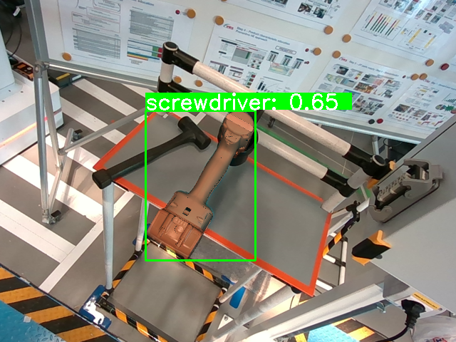
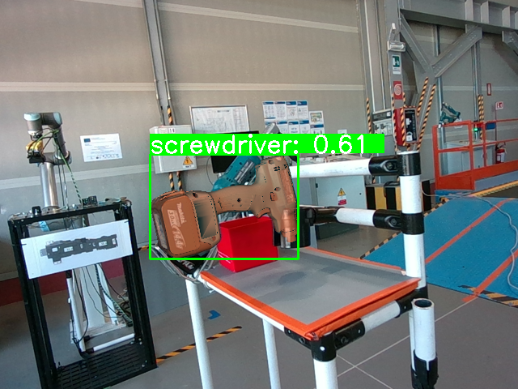
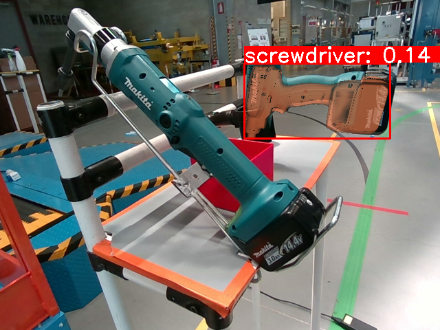
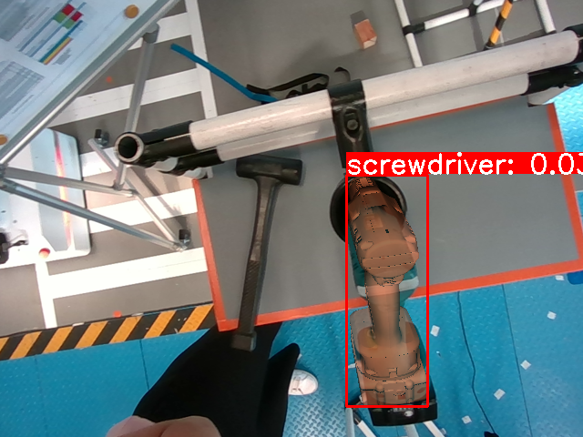

# COBRA - COnfidence score Based on shape Regression Analysis for method-independent quality assessment of object pose estimation from single images

**COBRA - COnfidence score Based on shape Regression Analysis for method-independent quality assessment of object pose estimation from single images** 

[Panagiotis Sapoutzoglou<sup>1,2</sup>](https://www.linkedin.com/in/panagiotis-sapoutzoglou-66984a201/), [Georgios Giapitzakis Tzintanos<sup>1</sup>](https://github.com/giorgosgiapis), [George
Terzakis<sup>2</sup>](https://github.com/terzakig), [Maria Pateraki<sup>1,2</sup>](http://www.mpateraki.org/)

[<sup>1</sup>National Technical University of Athens](https://ntua.gr/en/), Athens, Greece <br>
[<sup>2</sup>Institute of Communication & Computer Systems](https://www.iccs.gr/en/), Athens, Greece

[](https://arxiv.org/abs/2404.16471)

[](https://pose-lab.github.io/projects/COBRA/)

**Abstract**: We present a generic algorithm for scoring pose estimation methods that rely on single image semantic analysis. The algorithm employs a lightweight putative shape representation using a combination of multiple Gaussian Processes. Each Gaussian Process (GP) yields distance normal distributions from multiple reference points in the object’s coordinate system to its surface, thus providing a geometric evaluation framework for scoring predicted poses. Our confidence measure comprises the average mixture probability of pixel back-projections onto the shape template. In the reported experiments, we compare the accuracy of our GP based representation of objects versus the actual geometric models and demonstrate the ability of our method to capture the influence of outliers as opposed to the corresponding intrinsic measures that ship with the segmentation and pose estimation methods.

## Overview

The core functionality of this repo can be summarized in six steps:

- Installation: Set up the Conda environment and install dependencies using the provided instructions.
- Sample points from a 3D model to serve as the training and test sets. This is done by utilizing the script ```preprocessing.py```.
- Train COBRA to represent the shape of the object. This is done by running the ```train.py``` script.
- Evaluate the trained model over the query test points with ```infer.py```.
- Compute evaluation metrics with ```eval.py```.
- Use the trained model to score estimated poses pre-computed from an independent pose estimation algorithm with ```score_poses.py```.

## Installation

- Clone the repository and setup the conda environment:
```
git clone https://github.com/pansap99/COBRA.git
cd COBRA
conda env create -f environment.yml
```
- Install the pose visualization toolkit by downloading the wheel file inside the ```vis``` directory:

```
cd vis
pip install pose_vis-1.0-py3-none-any.whl
```
This package utilizes OpenGL to render the estimated poses and overlay them into the images, together with their derived confidence.

**NOTE**: If you encounter an error similar to this one: ```libGL error: MESA-LOADER: failed to open iris``` you can try to resolve it by running :
```export LD_PRELOAD=/usr/lib/x86_64-linux-gnu/libstdc++.so.6```

## File organization

You have to place your 3D models under ```./data/models/original/{your_class_name}```. You can change the paths to save the data in ```common.py```.


## Sampling - Preprocessing

We define virtual cameras around the object and ray-casting to acquire points lying only on the outer surface of the object. To sample points for the train and test point-clouds run:

```
python preprocessing.py \
--class-name your_class_name \ 
--num-samples 10000 250000 \ #samples for train and test pcds
```

After runing the command, the folders ```./data/models/train/{your_class_name}``` and ```./data/models/test/{your_class_name}``` will be created containing the train and test point clouds for your models.

## Training 

To train COBRA to represent the shape of the objects you simply run:

```
python train.py \
--class-name your_class_name \
--init-lr 0.1
--cluster-overlap 0.2 
--normalize \ 
--num-steps \ 
--min-num-classes \ 
--max-num-classes \ 
--step
```
A full list of commands can be seen running ```python train.py --help``` as we utilize Tyro cli for the arguments.

After training the trained GP models are saved in ```./data/results/{class_name}/c{num_ref_points}/gps```.

## Infer query points 

To infer the query test point you can run:

```
python infer.py --class_name your_class_name
```

A full list of the subcomands can be found by running ```python infer.py --help```.

# Evaluation

To evaluate the infered point clouds against the ground truth and compute the metrics you can run:

```
python eval.py --class_name class_name
```
Again a full list of the subcomands can be found by running ```python eval.py --help```. By running this script the best models (i.e. the results for the optimal number of reference points with respect to best metric's error) will be exctracted as .ply files in ```./data/models/est_models/{class_name}```.
The total metrics will be saved under ```./data/results/{class_name}/total_scores.csv``` and they will also be printed in the terminall.
```
        Chairs Statistics          
┏━━━━━━━━━━━┳━━━━━━━━━━━┳━━━━━━━━━━━┓
┃ Metric    ┃   Mean    ┃  Median   ┃
┡━━━━━━━━━━━╇━━━━━━━━━━━╇━━━━━━━━━━━┩
│ cd        │ 0.000194  │ 0.000191  │
│ emd       │ 0.017624  │ 0.014774  │
│ precision │ 83.789200 │ 83.322800 │
│ recall    │ 91.646533 │ 91.149200 │
│ f1_score  │ 87.529484 │ 88.061813 │
└───────────┴───────────┴───────────┘
```
# Point cloud visualization

To visualize the output point clouds you can run:

```
python vis.py --num-points num_points # Subset of points to visualize \
```
We utilize Blender's API to render the point clouds representing the points as spheres.

## Score 6D poses

To score pre-computed estimated poses with COBRA you will need to provide a file in .csv format that contains 2D-3D correspodences and the confidence output of your estimator. An example of the structure of the file can be seen below:

```
inlier,x,y,X,Y,Z,conf
1.0,534.0,166.0,73.149,114.048,10.581,0.138
1.0,534.0,166.0,75.803,108.941,19.653,0.235
1.0,538.0,166.0,75.970,112.339,7.050,0.278
```

Please follow the above structure of your data under the ```./scoring``` directory:

```
├── scoring
│   └── tools
│       └── screwdriver
│           ├── corrs
│           │   ├──  292_corr.txt
│           │   ├──  433_corr.txt
│           │   ├──  61_corr.txt
│           │   └──  74_corr.txt
│           ├── est_poses.json
│           ├── images
│           │   ├──  000061.png
│           │   ├──  000074.png
│           │   ├──  000292.png
│           │   └──  000433.png
│           ├── K.txt
│           └── vis
│               ├──  292.png
│               ├──  433.png
│               ├──  61.png
│               └──  74.png
```

where:
- ```tools``` is the class name.
- ```screwdriver``` is the model name.
- ```corrs``` folder contains the csv files with the 2D-3D correspodences.
- ```images``` folder contaning the images that depict the object.
- ```est_poses.json``` are the estimated 6D poses of the object in the images under the ```images``` folder.
- ```vis``` folder will contain the visualization of the estimated poses together with the computed confidence score.

To score 6D poses:

```
python score_poses.py \
--class-name your_class_name \
--model your_model_name \
--delta delta_value \
--visualize
```

An example can be seen below:

Note that the **<span style="color:green">green</span>** outline indicates that the computed score is **greater** than the lower bound for the given delta value while the **<span style="color:red">red</span>**  outline that the score is **lower** than the lower bound.


<p align="center">
    
    
     
    
</p>

Additionally, a file is created under ```./scoring/{class_name}/{model_name}/``` called scores.json which contain the computed confidence score for the images togehter with the confidence lower bound value. An example of the demo can be seen below:

```
{
    "Confidence Lower Bound": 0.31185796164421375,
    "scores": [
        [
            [
                "292",
                0.13946695218024632
            ],
            [
                "74",
                0.03143337440356358
            ],
            [
                "61",
                0.6488445935372978
            ],
            [
                "433",
                0.5069502524015893
            ]
        ]
    ]
}
```

## Citation

```
@misc{sapoutzoglou2024cobra,
        title={COBRA - COnfidence score Based on shape Regression Analysis for method-independent quality assessment of object pose estimation from single images}, 
        author={Panagiotis Sapoutzoglou and George Giapitzakis and George Terzakis and Maria Pateraki},
        year={2024},
        eprint={2404.16471},
        archivePrefix={arXiv},
        primaryClass={cs.CV},
        url={https://arxiv.org/abs/2404.16471}
}
```


